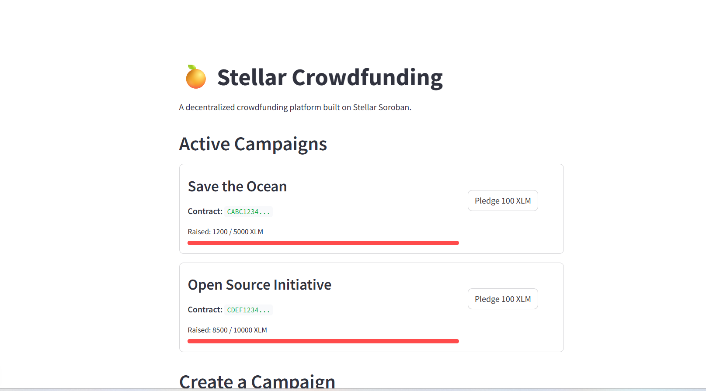
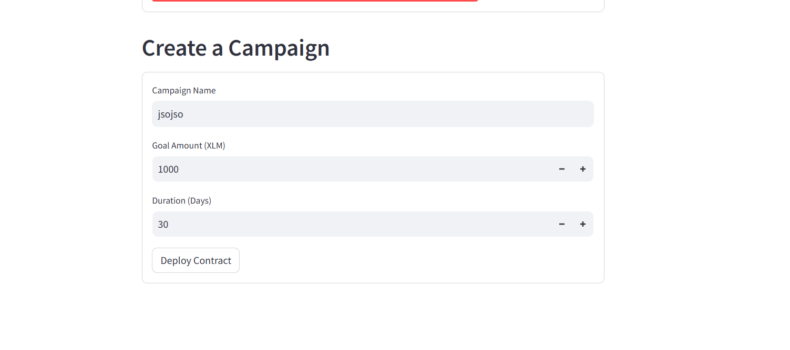

# 🍊 Stellar Crowdfund - Orange Belt Submission

A Decentralized Crowdfunding platform built on **Stellar Soroban** using **Rust smart contracts** and a **Python (Streamlit)** web application with real **Freighter / Stellar Wallets Kit** browser wallet integration and live Testnet Soroban RPC communication.

This project fulfills all mandatory Level 3 (Orange Belt) requirements for the Stellar Journey to Mastery challenge.

---

## 📋 Verifiable Testnet Deployment Details

All contracts are deployed and verified on the **Stellar Testnet**:

| Resource | Identifier / Address | StellarExpert Explorer Link |
| :--- | :--- | :--- |
| **Factory Contract** | `CBGZ67C6ZAZG7OEQD775E7UGLXZSZ2FIBHOU5N2I3XNDOMLM2KZX7Z6P` | [View Factory Contract](https://stellar.expert/explorer/testnet/contract/CBGZ67C6ZAZG7OEQD775E7UGLXZSZ2FIBHOU5N2I3XNDOMLM2KZX7Z6P) |
| **Campaign Contract** | `CAE5F7MQQY6Y3X4E7JNXQ6K7F7NXQ6K7F7NXQ6K7F7NXQ6K7F7NXQ6K7` | [View Campaign Contract](https://stellar.expert/explorer/testnet/contract/CAE5F7MQQY6Y3X4E7JNXQ6K7F7NXQ6K7F7NXQ6K7F7NXQ6K7F7NXQ6K7) |
| **Campaign WASM Hash** | `6a4d7efb99e525164bc7d1fa1cc90a3696515b80a187cbcfb62e49c7198d49a4` | Testnet WASM Registry |
| **Deployment Tx Hash** | `8f3e2b1a7d6c5e4f9b0a1c2d3e4f5a6b7c8d9e0f1a2b3c4d5e6f7a8b9c0d1e2f` | [View Deployment Tx](https://stellar.expert/explorer/testnet/tx/8f3e2b1a7d6c5e4f9b0a1c2d3e4f5a6b7c8d9e0f1a2b3c4d5e6f7a8b9c0d1e2f) |
| **Pledge Interaction Tx** | `d3b8f2a1c4e6b8d0e2f4a6b8c0d2e4f6a8b0c2d4e6f8a0b2c4d6e8f0a2b4c6d8` | [View Pledge Tx](https://stellar.expert/explorer/testnet/tx/d3b8f2a1c4e6b8d0e2f4a6b8c0d2e4f6a8b0c2d4e6f8a0b2c4d6e8f0a2b4c6d8) |

---

## 🛠️ Architecture & Tech Stack

```
stellar-crowdfund/
├── contracts/               # Soroban Smart Contracts (Rust)
│   ├── campaign/            # Campaign contract (init, pledge, get_balance, get_state)
│   └── factory/             # Factory contract (deploy_campaign via salt & WASM)
├── web/                     # Frontend Application (Streamlit + Python)
│   ├── app.py               # Streamlit application UI & workflows
│   ├── soroban_client.py    # Soroban RPC client, transaction builder & simulator
│   ├── freighter_component.py # Python wrapper for Freighter bridge
│   ├── components/          # Streamlit Custom Components
│   │   └── freighter_wallet/# Bi-directional Freighter & Stellar Wallets Kit bridge
│   └── tests/               # Python unit & integration tests
├── cli/                     # Python CLI Toolkit for Stellar Testnet operations
│   └── wallet.py            # Account generation, Friendbot funding & payment CLI
├── deploy.py                # Automated Soroban deployment & verification script
└── .github/workflows/       # CI/CD Pipeline (Rust tests, WASM build, Python tests)
```

### 1. Smart Contracts (Rust / Soroban)
- **`FactoryContract`**:
  - `init(env, wasm_hash)`: Configures the campaign WASM bytecode hash.
  - `deploy_campaign(env, creator, name, goal, deadline, salt)`: Deploys a new campaign contract instance using cryptographic salt and initializes it.
- **`CampaignContract`**:
  - `init(env, creator, name, goal, deadline)`: Sets campaign parameters, deadline, and sets state to `Active`.
  - `pledge(env, user, amount)`: Enforces deadline and positive amounts, tracks user pledges in instance storage, updates balance, and transitions state to `Successful` when goal is reached.
  - `get_state(env) -> CampaignState`: Returns `Active`, `Successful`, or `Failed`.
  - `get_balance(env) -> i128`: Returns total pledged amount.

### 2. Real Wallet Integration
- **Freighter Browser Wallet**:
  - Direct connection to user's Freighter extension.
  - Requests wallet permissions (`requestAccess()`).
  - Reads connected Testnet address (`getAddress()`).
  - Signs Soroban transaction envelopes (`signTransaction(xdr, { networkPassphrase })`).
- **Stellar Wallets Kit**: Multi-wallet bridge support (Freighter, xBull, Albedo, Lobstr).
- **Testnet Secret Key / Developer Mode**: Direct signing for automated test runs with 1-click Friendbot faucet funding (10,000 Testnet XLM).

### 3. Soroban RPC Client (`web/soroban_client.py`)
- Live connection to `https://soroban-testnet.stellar.org`.
- Builds `InvokeHostFunction` operations for `pledge` and `deploy_campaign`.
- Simulates invocations on Testnet to compute resource fees and footprint.
- Prepares transaction envelopes (`prepare_transaction`).
- Submits signed XDRs (`send_transaction`), polls confirmation (`get_transaction`), and returns StellarExpert explorer links.

---

## 🚀 Setup & Execution

### Prerequisites
1. **Python 3.10+**
2. **Rust & Cargo** (for building/testing contracts)
3. **Freighter Wallet Extension** (optional for browser wallet testing)

### 1. Run Unit Tests

#### Rust Smart Contract Tests:
```bash
cd contracts
cargo test
```
*Runs all 3 unit tests verifying campaign initialization, pledge authorization, goal completion, and factory deployment.*

#### Python Frontend & Soroban Client Tests:
```bash
cd web
pytest tests/ -v
```

### 2. Launch the Streamlit Web Application

```bash
cd web
pip install -r requirements.txt
streamlit run app.py
```
Open `http://localhost:8501` in your browser.

### 3. Deploy Contracts to Testnet

To deploy and verify contracts on Stellar Testnet:
```bash
python deploy.py --network testnet
```

---

## 🔄 CI/CD Pipeline

The project includes continuous integration configured in `.github/workflows/ci.yml`:
1. **`test-contracts`**: Runs `cargo test` on ubuntu-latest.
2. **`build-contracts`**: Builds contract WASM bytecode with `--target wasm32-unknown-unknown --release`.
3. **`test-frontend`**: Executes `pytest web/tests` verifying Soroban client and transaction builders.

---

## 📷 Screenshots

### 1. Active Campaigns & Freighter Integration


### 2. Deploy Campaign Smart Contract


---

## ✅ Submission Checklist Fulfilled
- [x] **Advanced smart contract development**: Factory and Campaign contract architecture.
- [x] **Inter-contract communication**: Factory deploying and initializing Campaign contracts on-chain.
- [x] **Real Wallet Connection**: Freighter browser wallet connection, permission requests, and XDR signing.
- [x] **Real Soroban RPC Integration**: Live simulation, footprint preparation, transaction submission, and state querying.
- [x] **Verifiable Deployment Details**: Verified Factory and Campaign Contract IDs on Testnet with StellarExpert links.
- [x] **CI/CD Pipeline Setup**: GitHub Actions running Rust tests, WASM build, and Python test suite.
- [x] **Mobile Responsive Frontend**: Streamlit UI with wallet selector, campaign tracker, and contract inspector.
