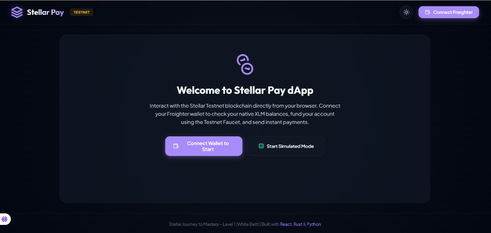
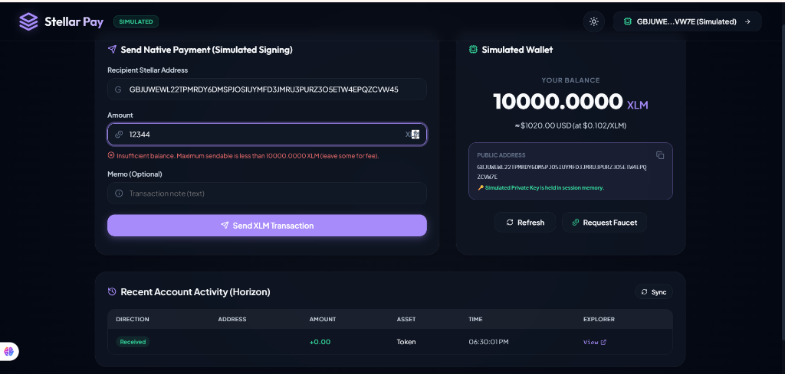

# Stellar Pay - Stellar Journey to Mastery (Level 1: White Belt)

A polyglot decentralized application (dApp) built on the Stellar Testnet, showcasing wallet integrations, native XLM balance checks, instant faucet funding, and client-signed testnet transactions.

This repository implements the requirements for **Level 1 (White Belt)** of the *Stellar Journey to Mastery* Monthly Builder Challenge.

---

## 🛠️ Tech Stack & Architecture

-   **Frontend**: React (v19), TypeScript, Vite, Lucide Icons, and `@stellar/freighter-api` (v6.x) for browser extension signing. Custom Vanilla CSS theme with a fully responsive glassmorphism UI supporting interactive dark/light modes.
-   **Backend API (Rust)**: Axum-based server that acts as a proxy for CoinGecko price data, routes transactions, and coordinates Friendbot faucet funding.
-   **Developer CLI (Python)**: Command-line companion using `stellar-sdk` to quickly generate keys, inspect balances, and execute terminal payments.

---

## 🚀 Local Installation & Setup

### Prerequisites
1.  **Node.js**: v18+ (with `npm` or `yarn`).
2.  **Python**: v3.9+ (with `pip`).
3.  **Rust**: `cargo` (optional, needed only to run the local backend server. The frontend automatically falls back to direct Horizon queries if the backend isn't running).
4.  **Freighter Wallet Browser Extension**: Installed and configured to **Testnet**.

---

### 1. Frontend Setup
Navigate to the `frontend` folder, install dependencies, and start the development server:

```bash
cd frontend
npm install
npm run dev
```

The frontend will start running on **`http://localhost:5173`**. Open this URL in your web browser.

---

### 2. Backend Setup (Rust - Optional)
To compile and run the backend proxy server:

```bash
cd backend
cargo run
```

The backend server runs on **`http://localhost:8080`**.

---

### 3. Developer CLI Setup (Python)
To run the Python wallet tool:

```bash
cd cli
pip install -r requirements.txt
```

Available commands:
```bash
# Generate a new Testnet wallet (Public Key & Secret Seed)
python wallet.py generate

# Check XLM balance of a public key
python wallet.py balance <PUBLIC_KEY>

# Fund a public key with 10,000 Testnet XLM via Friendbot
python wallet.py faucet <PUBLIC_KEY>

# Send testnet XLM using a private secret key
python wallet.py send <SECRET_SEED> <DESTINATION_PUBLIC_KEY> <AMOUNT> --memo "optional text"
```

---

## 📷 Submission Screenshots

Below are the screenshots illustrating the successful integration and execution of the dApp.
### 1. Welcome Landing Screen
*Welcome screen of the Stellar Pay application, showing options to connect Freighter or start Simulated Mode.*



### 2. Active Simulated Wallet Dashboard
*Simulated dashboard showing funded Testnet XLM balance, recipient transaction form, and transaction history logs.*



